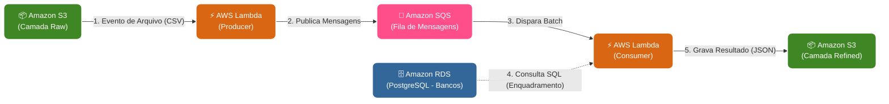

# EDB022 — Atividade 7: Pipeline em Cloud Computing (Streaming)

Disciplina **eEDB-011 — Ingestão de Dados** (PECE / Escola Politécnica da USP)
Prof. Leandro Mendes Ferreira

## Objetivo

Implementar um pipeline de **streaming serverless na AWS**, no qual:

1. Um **Produtor** (AWS Lambda) lê os dados de **Reclamações** no S3 (camada Raw) e publica cada registro como uma mensagem em uma fila **AWS SQS**.
2. Uma fila **AWS SQS** desacopla produção e consumo.
3. Um **Consumidor/Enriquecedor** (AWS Lambda, disparada pela SQS) recebe cada mensagem, consulta o banco de dados SQL (dados de **Bancos**, já tratados) para enriquecer a reclamação, e grava o resultado em um bucket **S3** (camada de saída).



## Dados utilizados

| Fonte           | Arquivo(s) originais                                    | Formato          | Uso nesta atividade                                    |
| --------------- | ------------------------------------------------------- | ---------------- | ------------------------------------------------------ |
| **Reclamações** | `Dados/Reclamações/2021_tri_01.csv` … `2022_tri_04.csv` | CSV `;`, Latin-1 | Entrada do **Produtor** (uma mensagem por linha)       |
| **Bancos**      | `Dados/Bancos/EnquadramentoInicia_v2.tsv`               | TSV, Latin-1     | Fonte de enriquecimento consultada pelo **Consumidor** |

Os arquivos de amostra reduzidos (20-30 linhas) estão disponíveis nas pastas `data/reclamacoes_sample/` e `data/bancos_sample/` para permitir testes rápidos.

## Pré-requisitos

- Conta AWS logada via terminal (Ambientes AWS Academy com `LabRole` são suportados por padrão)
- AWS CLI instalado e configurado nas suas variáveis de ambiente (`aws configure`)
- Python 3.11 instalado localmente
- Terminal PowerShell (Windows)
- Um banco de dados relacional (RDS/PostgreSQL ou banco remoto) para a tabela de enriquecimento `bancos`.

## Instalação e Configuração

**1. Clone o repositório:**
```bash
git clone https://github.com/bigauke/edb022-atividade7-streaming-aws.git
cd edb022-atividade7-streaming-aws
```

**2. Configure as variáveis de ambiente (Apenas para testes locais):**
Copie o arquivo base para o arquivo local.
```bash
cp .env.example .env
```
O CloudFormation não vai ler esse arquivo. As variáveis finais de nuvem serão inseridas diretamente na AWS depois.

**3. Instale as dependências na sua máquina local:**
```bash
pip install -r requirements.txt
```

## Deploy na Nuvem (AWS)

Para contornar eventuais conflitos com o AWS SAM (falta de CLI ou bugs de permissões restritas em contas educacionais), criamos um fluxo automatizado e enxuto em **PowerShell**, orquestrado nativamente usando AWS CloudFormation.

Execute o script de automação no terminal:

```powershell
powershell -ExecutionPolicy Bypass -File scripts\deploy.ps1
```

**O script de build automático fará o seguinte trabalho duro para você:**
1. Fazer o download das bibliotecas (Python packages como `pandas`, `psycopg2-binary`, `pyarrow`) listadas no requirements e incluí-las nos diretórios das Lambdas correspondentes.
2. Criar um S3 Bucket dinâmico na sua conta para servir de ponte para o envio dos arquivos Zipados.
3. Empacotar automaticamente o código das pastas e criar o arquivo `infra/packaged.yaml` usando a nuvem.
4. Enviar a Stack batizada de `edb022-streaming` usando suas credenciais locais para gerenciar todo o CloudFormation.

---

### Ajuste de Conexões do Banco Após o Deploy

Por padrão, a stack recém-criada sobe o banco de dados na Lambda com variáveis dummy (como `test-host`, `test-db`). Para a sua Lambda se conectar à sua base real:

1. Acesse o [Console da AWS](https://console.aws.amazon.com) pelo navegador.
2. Navegue até o serviço **Lambda**.
3. Encontre e abra a função **`edb022-atv7-consumer`**.
4. Vá até a guia **Configurações > Variáveis de ambiente**.
5. Clique em **Editar** e substitua os valores fictícios pelas credenciais do seu banco:
   - `DB_HOST`
   - `DB_NAME`
   - `DB_USER`
   - `DB_PASSWORD`
   
---

### Execução de Teste do Pipeline

**1. Preencha seu Banco de Dados**
No terminal da sua máquina, aponte para o banco real usando as envs e suba os dados de bancos da amostra:
```bash
python scripts/load_bancos.py --path data/bancos_sample/enquadramento_amostra.tsv
```

**2. Acione os eventos com o S3**
Usando a interface web da AWS S3 (ou pelo CLI), vá até o Bucket recém-criado pelo projeto (ele iniciará com `edb022-streaming-reclamacoesbucket-`).
Dentro dele, você deve fazer upload de um arquivo de reclamações de amostra presente no repositório local (ex: `data/reclamacoes_sample/amostra.csv`) simulando o prefixo da camada RAW.
*Caminho de Upload: `raw/reclamacoes/amostra.csv`*

**3. Validação do Sucesso**
A chegada do arquivo vai gerar as trilhas via SNS/SQS invisíveis até invocar o Consumer Lambda.
Volte para o Bucket S3 e verifique a pasta `refined/reclamacoes-bancos/`. Se houver os arquivos de saída JSON gerados por particionamento e já com a instituição enriquecida, seu deploy foi um sucesso!
